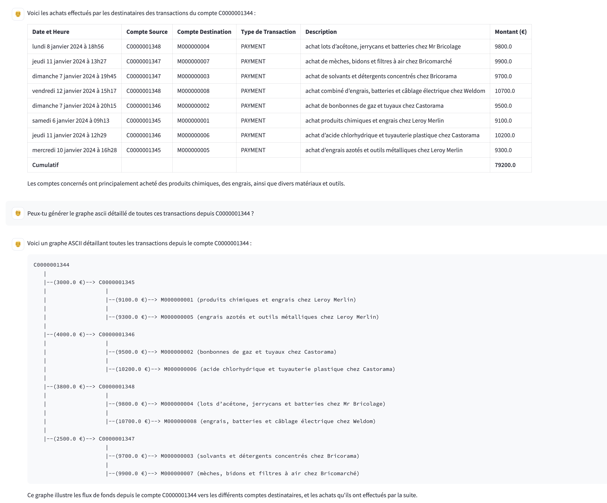

💸 Transactions AI – Analyse Générative des Transactions

Ce projet déploie une plateforme d’analyse de transactions enrichie par des vecteurs, des embeddings et une interface utilisateur. 
Il s’appuie sur 
 *  **Elastic Cloud** pour l’indexation et la recherche sémantique
    * recherche vectorielle avec le model built-in .rerank-v1-elasticsearch
    * reranking sémantique  avec le model built-in .multilingual-e5-small-elasticsearch  
 *  et sur **Azure OpenAI** pour les capacités d’IA générative (GPT-4o).

---
## 💳 Nature du dataset exploité

### Types de transactions expliqués
Voici un résumé simple de chaque type de transaction:

CASH-IN
➤ Quand un utilisateur dépose de l’argent sur son compte mobile via un commerçant (agent).
➤ Le solde du compte augmente.

CASH-OUT
➤ L’inverse du CASH-IN : l’utilisateur retire de l’argent de son compte mobile chez un commerçant.
➤ Le solde du compte diminue.

DEBIT
➤ Similaire à un CASH-OUT, mais ici, l’argent est envoyé vers un compte bancaire.
➤ Cela diminue aussi le solde du compte mobile.

PAYMENT
➤ L’utilisateur paie un commerçant pour acheter un bien ou un service.
➤ Le solde de l’utilisateur diminue, et celui du commerçant augmente.

TRANSFER
➤ L’utilisateur envoie de l’argent à un autre utilisateur du même service.
➤ Le solde de l’émetteur diminue, celui du destinataire augmente.

### Et maintenant ?
Pour mieux détecter les fraudes, on pourrait :
* Analyser les comportements : un utilisateur retire tout son argent juste après un dépôt ? Ou transfère à plusieurs comptes en chaîne ?
* Créer des indicateurs de risque : fréquence des transferts, montants inhabituels, changement soudain d’emplacement géographique, etc.
* Ajouter des données temporelles : à quelle heure ? à quel jour ? Est-ce normal de faire un CASH-OUT à 3h du matin ?


### Structure des colonnes
Voici ce que chaque colonne représente :

| **Colonne**      | **Description**                                                        |
| ---------------- | ---------------------------------------------------------------------- |
| `step`           | Unité de temps (souvent 1 unité = 1 heure)                             |
| `type`           | Type de transaction (`PAYMENT`, `TRANSFER`, etc.)                      |
| `amount`         | Montant de la transaction                                              |
| `nameOrig`       | Identifiant du compte émetteur                                         |
| `oldbalanceOrg`  | Solde du compte émetteur avant la transaction                          |
| `newbalanceOrig` | Solde du compte émetteur après la transaction                          |
| `nameDest`       | Identifiant du compte destinataire                                     |
| `oldbalanceDest` | Solde du compte destinataire avant la transaction                      |
| `newbalanceDest` | Solde du compte destinataire après la transaction                      |
| `isFraud`        | `1` si la transaction est une fraude, `0` sinon                        |
| `isFlaggedFraud` | `1` si le système a marqué cette transaction comme suspecte, `0` sinon |

---

## ✅ Prérequis

### 1. Créer un cluster sur Elastic Cloud

- Version minimale ECH **8.18.2**

- **Hot data** : 3 AZ × 4 Go RAM/AZ (3 AZs car l'indice sera sur 3 shards primaires) 
- **Machine learning nodes** : 2 AZ × 4 Go RAM/AZ
- **Kibana** : 1 AZ × 2 Go RAM/AZ

À récupérer depuis l’interface Elastic Cloud :
- le cloud id du cluster
- l'endoint des noeuds elasticsearch  `https://<nomcluster>.es.<region>.<csp>.cloud.es.io`
- le mot de passe de l'utilisateur `elastic`, téléchargeable dès la création du cluster

---

### 2. Disposer d’un déploiement Azure OpenAI

Depuis [Azure OpenAI](https://portal.azure.com/) :
- Déployer un modèle **GPT-4o**
- Obtenir :
  - la clé API du déploiement 
  - Nom du déploiement azure
  - L'URL de base du déploiement.  ex. `https://votreservice.openai.azure.com`
  - La version d’API. Actuellement elle est égale à `2025-01-01-preview`

---

### 3. Lancer une machine Debian 11 (VM)

Prendre à minima 4Go RAM, 4 vCPUs, 80 Go Disk  

---

## 🚀 Installation du projet

### 4. Cloner le dépôt

```bash
apt install -y git-lfs
git lfs install
git clone https://github.com/Danouchka/rag_transactions_analysis.git transactions
cd transactions
git lfs pull
```


---

### 5. Configurer les variables d’environnement

Mettre à jour le fichier `config/.env` avec vos propres valeurs :

```env
export es_cloud_id="nomcluster:ZXVyb3BlLXdlcXXXXXXXXXXMmRjODhjOTBlZTIxNGJlYTlYYYYYYYjM2YzA5NzkyMmUkOTYwZWFkNzI1YmM5NDJhYzg5ZDc3ZjViMmQyOGYxZDY="
export es_password="mot de passe correspondant au user es_admin"
export es_endpoint="https://nomcluster.es.region.csp.cloud.es.io"
export es_admin="elastic"
export es_indice="logs-transaction.service-default"

export openai_api_key="your_api_key"
export openai_azure_base_url="https://votredomain.openai.azure.com"
export openai_azure_version="2025-01-01-preview"
export openai_azure_deployment_name="le_nom_de_votre_deploiement"
export openai_model_name="gpt-4o"
```

---

### 6. Configurer l’accès à l’interface Streamlit

Éditer le fichier `run/.streamlit/secrets` pour éditer éventuellement le mot de passe admin :

```ini
[passwords]
# Follow the rule: username = "password"
admin = "hellodemo"
```

---

### 7. Construire et indexer le dataset

```bash
cd transactions/build
sh build.sh
```

> 🕒 Le script va lire et envoyer les données ligne par ligne vers Elasticsearch. Cela peut prendre plusieurs heures voire jours selon la taille du dataset.

---

### 8. Lancer l’application Streamlit

Dans un **nouveau terminal ou une seconde session SSH** :

```bash
cd transactions/run
./run.sh
```

Un lien `http://<ip externe>:5609` ou équivalent s’affiche dans la console.

Ouvrir ce lien dans un navigateur et se connecter avec :
- **Utilisateur** : `admin`
- **Mot de passe** : celui défini dans `config/.streamlit/secrets`

---

## 🔍 Fonctionnalités

- Ingestion de logs de transactions enrichis
- Recherche par mots-clés et sémantique (vector search)
- Génération d’explications avec GPT-4o
- Interface utilisateur en Streamlit
- RAG Agentic

---


## 📬 Support

Pour toute question, bug ou amélioration, veuillez ouvrir une **issue GitHub** ou contacter l'équipe en charge du projet.


## 🎬 Demo
Poser les questions suivantes dans cet ordre: 

1. Qui a acheté des engrais et des produits chimiques ?
2. De qui ont-ils reçu des fonds, tous types de transactions confondus ?
3. Quelles sont les transactions dont C0000001344 est à l'origine ? 
4. Qu'ont acheté tous ces destinataires ? 
5. Peux-tu générer le graphe ascii détaillé de toutes ces transactions depuis C0000001344 ? 

<div style="border: 2px solid black;"></div>
